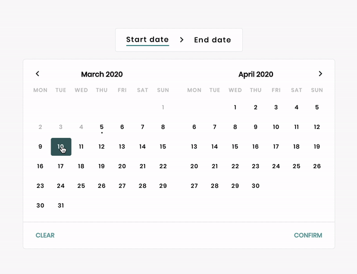

## Vue date range select

A Vue date range select component for updating Javascript Date objects. Provides great user feedback, easy customisation by overwriting the styles. (When to show / hide the calendar is up to you)

Created with Typescript, Vue and uses [Rollup](https://vuejs.org/v2/cookbook/packaging-sfc-for-npm.html) to build the npm package.

- [Demo](#demo)
- [Installation](#installation)
- [Usage](#usage)
- [Available props](#available-props)
- [Component functions](#component-functions)
- [Code example](#code-example)
- [Contributions](#contributions)

## Installation
`npm i vue-date-range-select`

## Usage
1. Import component
```js
import VueDateRangeSelect from 'vue-date-range-select';
```

2. Import styles, or write your own [styles](./src/vue-date-range-select.vue) (scroll to bottom to copy the initial styling)
```js
import 'vue-date-range-select/styles.css';
```

3. Add component to your template
```html
<template>
  <!-- ... -->
  <vue-date-range-select v-model="{ endDate: null, startDate: null }">
  <!-- ... -->
</template>

<script>
export default {
  // ...
  components: {
    VueDateRangeSelect
  }
  // ...
}
</script>
```

## Available props
| Prop             | Type                                               | Default                             | Description                      |
|------------------|----------------------------------------------------|-------------------------------------|----------------------------------|
| value            | { startDate: null \| Date, endDate: null \| Date } | { startDate: null, endDate: null }  | Date values of date picker       |
| monthCount       | number                                             | 2                                   | Amount of months shown in select |
| locale           | string                                             | en-EN                               | Used for setting language of months and days [MDN](https://developer.mozilla.org/en-US/docs/Web/JavaScript/Reference/Global_Objects/Date/toLocaleDateString)|
| hideYear         | boolean                                            | false                               | Stop showing year next to month  |
| canSelectInPast  | boolean                                            | false                               | Disables the user to select days in the past |
| startOnSunday    | boolean                                            | false                               | Show Sundays first               |


## Component functions
Functions inside the vue date range component to mutate the state from outside

```html
<template>
  <!-- ... -->
  <vue-date-range-select ref="dateRange" v-model="{ endDate: null, startDate: null }"/>

  <!-- Clear both startDate and endDate -->
  <button @click="$refs.dateRange.clear()">Clear</button>

  <!-- Force selecting endDate first  -->
  <button @click="$refs.dateRange.isSelectingStartDate = false">Select endDate</button>

  <!-- Force selecting startDate first  -->
  <button @click="$refs.dateRange.isSelectingStartDate = true">Select startDate</button>
  <!-- ... -->
</template>
```

## Slots
Add fields to the top of the date range select, or to the bottom

```html
<template>
  <!-- ... -->
  <vue-date-range-select v-model="{ endDate: null, startDate: null }">
    <template #header>Content added to the top of the calendar</template>
    <template #footer>Content added to the bottom of the calendar</template>
  </vue-date-range-select>
  <!-- ... -->
</template>
```

## Code example
[Advanced example with slots, date preview using Typescript](./src/serve-dev.vue)

### Running / seeing the advanced example?
1. Clone the project
2. `npm install`
3. `npm run serve`

## Contributions
Contributions would be very much appreciated!<br>
Please add some tests as well 🧪

Hope you like it
